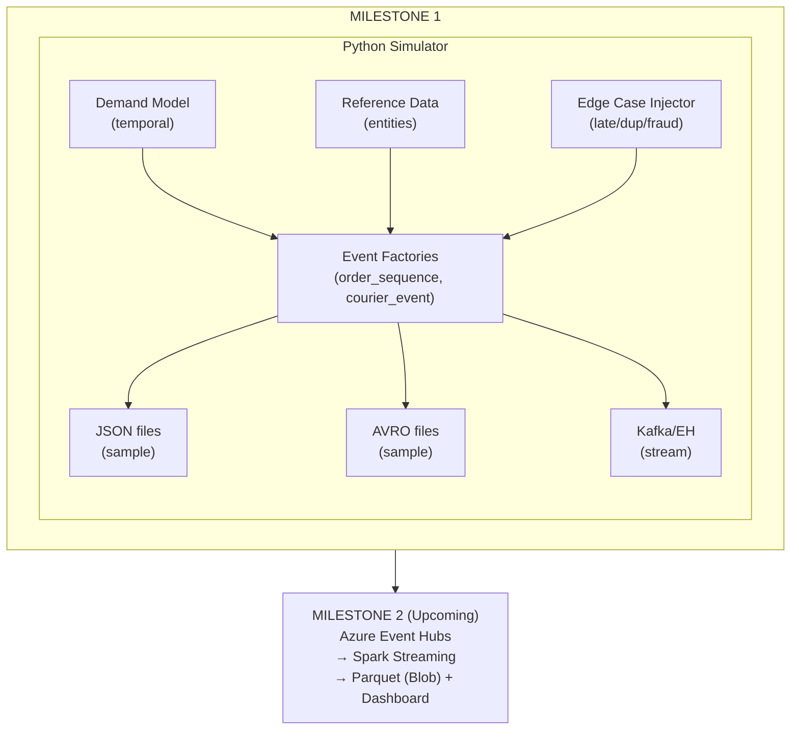
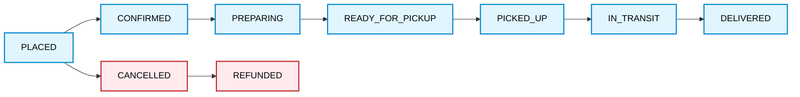
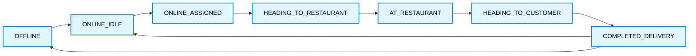

# Real-Time Food Delivery Streaming Analytics

> **Course Project – Milestone 1: Streaming Data Feed Design & Generation**
> Stream Analytics | Academic Year 2025/26

---

## Table of Contents

1. [Project Overview](#project-overview)
2. [Architecture Overview](#architecture-overview)
3. [Feed Design](#feed-design)
   - [Feed 1: Order Lifecycle Events](#feed-1-order-lifecycle-events)
   - [Feed 2: Courier Status Events](#feed-2-courier-status-events)
   - [Design Justification](#design-justification)
4. [Schema Design](#schema-design)
5. [Data Generator](#data-generator)
6. [Realism & Edge Cases](#realism--edge-cases)
7. [Repository Structure](#repository-structure)
8. [Quick Start](#quick-start)
9. [Planned Analytics (Milestone 2)](#planned-analytics-milestone-2)

---

## Project Overview

This project implements a **real-time analytics pipeline** for a food delivery platform (analogous to Uber Eats, Glovo, or Deliveroo). The platform operates as a real-time marketplace connecting customers, restaurants, and couriers — generating high-volume streaming data that must be processed, stored, and visualised with minimal latency.

**Milestone 1** delivers:
- Two streaming data feeds with full AVRO schemas
- A Python event generator supporting realistic distributions, configurable parameters, and a comprehensive suite of streaming edge cases
- Sample data in both JSON and AVRO formats
- A design document justifying all architectural choices with respect to planned analytics

---

## Architecture Overview



---

## Feed Design

### Feed 1: Order Lifecycle Events

**Topic:** `order-lifecycle-events`  
**Schema:** `schemas/order_lifecycle_event.avsc`

An **Order Lifecycle Event** is emitted every time an order transitions between states. Rather than emitting a single "completed order" record, we use the **event-sourcing pattern**: each state transition is its own immutable event. This is fundamental to streaming analytics because:

1. It enables **event-time processing** — each event carries the timestamp of the actual state transition, not when the pipeline processed it.
2. It enables **partial-order analytics** — we can detect SLA breaches in real-time (e.g., `PREPARING` for too long) without waiting for `DELIVERED`.
3. It produces a full audit trail for fraud detection.

**State Machine:**



**Key fields for analytics:**

| Field | Purpose |
|-------|---------|
| `event_time` | Actual timestamp of transition — watermark anchor |
| `ingestion_time` | Pipeline arrival time — delta = latency / late arrival |
| `order_id` | Join key across all events in same order sequence |
| `zone_id` | Zone-level aggregation for demand/surge analytics |
| `restaurant_id` | SLA monitoring join key |
| `courier_id` | Supply-demand join with Feed 2 |
| `estimated_*` vs `actual_*` | SLA breach computation |
| `device_id` + `customer_id` | Fraud clustering |
| `is_duplicate` / `is_late` | Streaming correctness test flags |

---

### Feed 2: Courier Status Events

**Topic:** `courier-status-events`  
**Schema:** `schemas/courier_status_event.avsc`

A **Courier Status Event** is emitted when a courier's state changes (assignment, movement milestone, going offline) or on a **periodic heartbeat** to maintain availability presence. This feed is essential because:

1. It powers **supply-side analytics** — how many couriers are available per zone at any moment.
2. It enables **session window analytics** — a courier's "active session" (online → offline) is a natural session boundary.
3. It provides the **location stream** needed for zone-level demand-supply balance.
4. It enables detection of **mid-delivery drops** (courier goes offline while carrying an order).

**State Machine:**



**Key fields for analytics:**

| Field | Purpose |
|-------|---------|
| `event_time` | Actual timestamp — watermark anchor |
| `courier_id` | Join key with order feed |
| `zone_id` | Supply-side zone counting |
| `status` | State machine node — session boundary detection |
| `active_session_id` | Groups events into a courier session |
| `session_start_time` | Session window start time |
| `latitude` / `longitude` | Geo-analytics, zone transitions |
| `speed_kmh` | Anomaly detection (impossible speeds) |
| `battery_pct` | Predictive offline event signal |
| `is_heartbeat` | Distinguish state changes from presence pings |
| `offline_reason` | Mid-delivery drop analysis |

---

### Design Justification

**Why these two feeds?**

The food delivery platform has three actors: customers, restaurants, and couriers. A single "order" feed would conflate demand-side and supply-side signals, making windowed aggregations messy and unscalable. By separating:

- **Order Lifecycle** (demand side): we isolate customer demand patterns, restaurant SLAs, and payment/fraud signals.
- **Courier Status** (supply side): we isolate courier availability, movement, and session behaviour.

This separation enables clean **stream-table joins** in Milestone 2 (e.g., joining order events with current courier availability counts to compute demand-supply gap per zone).

**Why event-sourcing (not snapshots)?**

A snapshot model (emit one record per completed order) would discard the timing of intermediate steps. We would lose the ability to:
- Detect that a restaurant took 35 minutes to prepare (SLA breach)
- Observe that an order had been in READY_FOR_PICKUP for 20 minutes with no courier (supply gap)
- Track real-time throughput (how many orders placed per minute)

Event-sourcing gives us **full temporal fidelity**, which is the prerequisite for meaningful streaming analytics.

**Why AVRO?**

- **Schema enforcement** prevents malformed events from silently corrupting aggregations.
- **Schema evolution** via versioning (`schema_version` field + namespace) allows adding fields without breaking existing consumers.
- **Binary compactness** reduces Event Hubs costs vs JSON at high throughput.
- **Logical types** (timestamp-millis) make event-time handling unambiguous across languages.

---

## Schema Design

Both schemas are in `schemas/` as `.avsc` files. Design principles:

| Principle | Implementation |
|-----------|---------------|
| **Event-time semantics** | `event_time` (timestamp-millis) on every event |
| **Late arrival detection** | `ingestion_time` alongside `event_time` |
| **Deduplication** | `event_id` (UUID) on every event |
| **Join support** | `order_id`, `restaurant_id`, `courier_id`, `zone_id` as explicit FK-like fields |
| **Null safety** | Union types `["null", "string"]` with `default: null` for optional fields |
| **Enum stability** | All categorical fields use AVRO enums with explicit symbol lists |
| **Extensibility** | `metadata: map<string>` for future fields without schema break |
| **Schema evolution** | `schema_version` string field + namespace versioning |
| **Testing flags** | `is_duplicate`, `is_late` for streaming correctness validation |

---

## Data Generator

### Components

```
generator/
├── config.py           # All simulation parameters (env-var overridable)
├── reference_data.py   # Restaurant and Courier entity generation
├── event_factories.py  # Pure event construction functions
├── avro_utils.py       # AVRO serialisation layer
└── simulator.py        # Orchestration, demand model, CLI
```

### Demand Model

The temporal demand model uses a **24-hour hourly multiplier array** calibrated to real food delivery patterns:

- **Lunch peak:** 12:00–14:00 (multiplier ~1.0)
- **Dinner peak:** 19:00–21:00 (multiplier ~1.0)
- **Night trough:** 02:00–05:00 (multiplier ~0.02)
- **Weekend boost:** 1.35× applied on top of hourly multiplier

### Zone Model

Five synthetic city zones with different demand weights and restaurant densities:

| Zone | Weight | Density |
|------|--------|---------|
| ZONE_CENTRAL | 30% | Very High |
| ZONE_EAST | 25% | High |
| ZONE_NORTH | 20% | High |
| ZONE_SOUTH | 15% | Medium |
| ZONE_WEST | 10% | Low |

### Cuisine-specific Distributions

Each cuisine type has calibrated prep time and order value distributions (Gaussian):

| Cuisine | Avg Prep (min) | Avg Value (€) |
|---------|---------------|---------------|
| Sushi | 25 ± 6 | €35 ± 10 |
| Indian | 22 ± 5 | €22 ± 6 |
| Pizza | 18 ± 4 | €18.5 ± 5 |
| Burger | 12 ± 3 | €14 ± 4 |
| Salad | 8 ± 2 | €12 ± 3 |

---

## Realism & Edge Cases

The generator implements the full spectrum of edge cases required for demonstrating streaming correctness:

| Edge Case | Implementation | Rate |
|-----------|---------------|------|
| **Late events** | `event_time` backdated by 60–300s, `ingestion_time` = now | 5% |
| **Duplicate events** | Same event re-emitted with `is_duplicate: true` | 2% |
| **Missing steps** | Order jumps from READY_FOR_PICKUP → IN_TRANSIT (no PICKED_UP) | 1% |
| **Impossible durations** | Delivery in <2s or >2 hours (anomaly detection) | 0.8% |
| **Courier mid-delivery drop** | Courier OFFLINE during active delivery | 1.5% |
| **Fraud clusters** | Group of customers sharing a device_id | 0.5% |
| **Demand surge** | Configurable zone surge (3× multiplier for 2 minutes) | Configurable |
| **Order cancellations** | Full cancellation with reason codes | 8% |
| **Promo orders** | Orders with promotional codes | 20% |

### Why These Edge Cases Matter for Streaming

- **Late events + watermarks:** Spark Structured Streaming requires a watermark strategy to handle late data. Our `is_late` flag allows us to measure how many events fall outside the watermark threshold and tune accordingly.
- **Duplicates + idempotent sinks:** Without deduplication on `event_id`, windowed aggregations will overcount. Our duplicates test the effectiveness of our dedup logic.
- **Missing steps:** Tests that our analytics don't break when expected intermediate events are absent (e.g., an order with no PICKED_UP should still count as delivered in KPI windows).
- **Impossible durations:** Seeds our anomaly detection use case (Milestone 2, Use Case 3).
- **Mid-delivery drops:** Tests session window closure and the demand-supply health metric (an in-flight order suddenly has no courier).

---

## Repository Structure

```
food-delivery-streaming/
├── README.md                          
├── docs/
│   └── milestone1_design.md           # Design document
├── schemas/
│   ├── order_lifecycle_event.avsc     # AVRO schema: order events
│   └── courier_status_event.avsc      # AVRO schema: courier events
├── generator/
│   ├── README.md                      # Generator-specific docs
│   ├── requirements.txt
│   ├── config.py                      # All simulation parameters
│   ├── reference_data.py              # Restaurant & courier entities
│   ├── event_factories.py             # Event construction functions
│   ├── avro_utils.py                  # AVRO serialisation
│   └── simulator.py                   # Main orchestrator + CLI
└── sample_data/
    ├── json/
    │   ├── order_lifecycle_events.json
    │   └── courier_status_events.json
    └── avro/
        ├── order_lifecycle_events.avro
        └── courier_status_events.avro
```

---

## Quick Start

```bash
# 1. Clone the repository
git clone https://github.com/beauuks/food-delivery-streaming.git
cd food-delivery-streaming

# 2. Install dependencies
pip install -r generator/requirements.txt

# 3. Generate sample data (batch mode)
cd generator
python simulator.py --mode batch --order-events 1000 --courier-events 500

# 4. Stream continuously (for Milestone 2)
python simulator.py --mode stream

# 5. Customise via environment variables
RESTAURANT_COUNT=100 COURIER_COUNT=150 SURGE_ENABLED=true \
SURGE_ZONE=ZONE_CENTRAL SURGE_MULTIPLIER=5.0 \
CANCELLATION_RATE=0.12 LATE_EVENT_RATE=0.10 \
python simulator.py --mode batch
```

**Available environment variables:**

| Variable | Default | Description |
|----------|---------|-------------|
| `RESTAURANT_COUNT` | 50 | Number of synthetic restaurants |
| `COURIER_COUNT` | 80 | Number of synthetic couriers |
| `BASE_ORDERS_PER_SECOND` | 2.0 | Peak throughput |
| `CANCELLATION_RATE` | 0.08 | Fraction of orders cancelled |
| `LATE_EVENT_RATE` | 0.05 | Fraction of events arriving late |
| `DUPLICATE_RATE` | 0.02 | Fraction of events duplicated |
| `MISSING_STEP_RATE` | 0.01 | Fraction of orders with missing lifecycle step |
| `IMPOSSIBLE_DURATION_RATE` | 0.008 | Fraction of orders with anomalous duration |
| `COURIER_MID_DELIVERY_DROP_RATE` | 0.015 | Fraction of couriers dropping mid-delivery |
| `SURGE_ENABLED` | true | Enable demand surge simulation |
| `SURGE_ZONE` | ZONE_CENTRAL | Zone to surge |
| `SURGE_MULTIPLIER` | 3.0 | Demand surge factor |
| `FRAUD_BURST` | true | Enable fraud cluster simulation |
| `SAMPLE_ORDER_EVENTS` | 500 | Batch mode: number of order events |
| `SAMPLE_COURIER_EVENTS` | 500 | Batch mode: number of courier events |

---

## Planned Analytics (Milestone 2)

The feed design was driven by the analytics we intend to implement in Milestone 2:

### Use Case 1 – Windowed KPIs
- Orders placed per 5-minute tumbling window, by zone
- Revenue per 1-hour hopping window
- Courier utilisation rate per 15-minute window

*Why our feeds support this:* Every event carries `event_time`, `zone_id`, `order_value_eur`. The watermark on `event_time` with `LATE_EVENT_RATE` will demonstrate late-data handling.

### Use Case 2 – Demand-Supply Health per Zone 
- Join order feed (PLACED events awaiting assignment) with courier feed (ONLINE_IDLE count)
- Compute `demand_supply_ratio = pending_orders / available_couriers` per zone per window
- Alert when ratio > 3 (supply gap) or < 0.3 (oversupply)

*Why our feeds support this:* Both feeds carry `zone_id`. Courier heartbeats maintain a current count of ONLINE_IDLE couriers per zone. Order PLACED events without a courier assignment signal unmet demand.

### Use Case 3 – Anomaly Detection on Delivery Times
- Compute rolling mean and std of `actual_delivery_minutes` per zone
- Flag orders > mean + 3σ as anomalies (z-score outlier)
- Handle late events: events arriving after watermark still trigger recomputation

*Why our feeds support this:* `actual_delivery_minutes` is computed from event timestamps in the sequence. `impossible_duration` events (0.8% of orders) seed the anomaly signal. The `is_late` flag lets us tune watermark thresholds.
